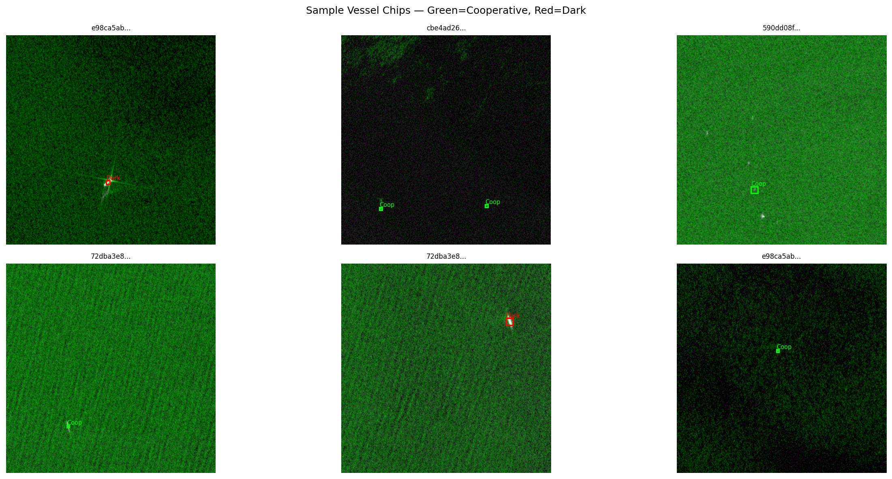

# 🛰️ VarunEye — Dark Vessel Detection using SAR + AIS

> Detects AIS-dark vessels across multiple Sentinel-1 SAR scenes using a
> fine-tuned YOLOv8s detector, correlated against Global Fishing Watch AIS
> records. Built as a demonstration of the maritime surveillance pipeline




---

## 🎯 Problem Statement

Roughly 75% of industrial fishing vessels and 25% of merchant ships operate
outside AIS monitoring at various points — creating regulatory blind spots
across coastal and high-seas waters. VarunEye detects these **dark vessels**
by fusing Sentinel-1 SAR imagery with AIS vessel records, flagging SAR
detections that have no corresponding AIS transmission.

---

## 🏗️ Pipeline Architecture

```
7 × Sentinel-1 SAR Scenes (xView3, ~29,000×24,000 px each)
        ↓
Per-scene land masking (owiMask.tif, auto ocean-value detection)
        ↓
640×640 chip generation (576 px stride, 64 px overlap)
        ↓
YOLOv8s vessel detection (fine-tuned on 1,890 multi-scene chips)
        ↓
Pixel → Lat/Lon (per-scene UTM zone → WGS84)
        ↓
Cross-chip NMS (30 px duplicate removal)
        ↓
Post-hoc land-detection filtering (owiMask cross-validation)
        ↓
GFW AIS correlation (±0.05°, ±30 min window, 4 monthly datasets)
        ↓
Dark vessel labeling (Dark / Cooperative / Suspicious)
        ↓
Streamlit + Folium interactive dashboard
```

---

## 📊 Results

| Metric | Value |
|---|---|
| Scenes | 7 (North Sea, Adriatic Sea, Gulf of Guinea, Bay of Biscay, English Channel) |
| Sensor | Sentinel-1 IW GRD (10 m/px) |
| Capture period | Jan – Jul 2020 |
| Training chips | 1,890 (multi-scene) |
| Model | YOLOv8s (11.1M params) |
| mAP@50 | 0.478 |
| Dark vessel AP@50 | 0.484 |
| Cooperative AP@50 | 0.473 |
| Ground-truth recall (1:1 matched) | 75.8% |
| Total detections (post-cleaning) | 1,754 |
| Dark vessels flagged | 46 |
| Cooperative (AIS matched) | 1,276 |
| Suspicious (unmatched, low confidence) | 432 |
| AIS records used | 1,426,288 across 4 monthly GFW datasets |

---

## 🗂️ Dataset

| Source | Purpose |
|---|---|
| [xView3-SAR](https://iuu.xview.us/) (tiny split) | Sentinel-1 SAR scenes + vessel labels |
| [Global Fishing Watch](https://globalfishingwatch.org/data-download/) SAR v3 | AIS vessel records, 4 monthly files (Jan/May/Jun/Jul 2020) |

7 scenes used: `05bc615a9b0e1159t`, `72dba3e82f782f67t`, `590dd08f71056cacv`,
`2899cfb18883251bt`, `b1844cde847a3942v`, `cbe4ad26fe73f118t`,
`e98ca5aba8849b06t`.

---

## 🛠️ Stack

| Component | Tool |
|---|---|
| SAR processing | rasterio, pyproj |
| Vessel detection | YOLOv8s (Ultralytics) |
| AIS correlation | pandas spatial join, monthly GFW datasets |
| Visualisation | Folium + Streamlit + Plotly |
| Training platform | Google Colab (T4 GPU), crash-safe per-scene checkpointing |

---

## 🚀 Run

```bash
git clone https://github.com/siddha-22/SARwithAIS.git
cd VarunEye
pip install -r requirements.txt

# Download trained weights from Releases and place at models/best_multiscene.pt
# https://github.com/siddha-22/SARwithAIS/releases

streamlit run app/app.py
```

The standalone interactive map (no server required) is available at
`outputs/dark_vessel_map_multiscene.html` — open directly in any browser.

---

## 📁 Structure

```
VarunEye/
├── data/
│   ├── raw/                  # SAR scenes + AIS CSVs (not in repo — see Data section)
│   ├── chips/                # Training chips (regenerated via notebooks/02)
│   └── processed/
│       └── detections_multiscene.csv   # Final pipeline output (included)
├── notebooks/
│   ├── SARwithAIS.ipynb
│   
├── app/
│   ├── app.py                # Streamlit dashboard
│   ├── map_view.py            # Folium map builder
│   └── stats_view.py          # Sidebar charts and tables
├── models/                    # best_multiscene.pt — see GitHub Releases
├── outputs/                   # Maps, training curves, sample visualisations
├── config.yaml
└── requirements.txt
```

---

## ⚠️ Known Limitations

**Coastal false positives.** A small fraction of detections (~17.5% before
post-hoc filtering, reduced but not eliminated after) fall near or on
coastlines rather than open water. Three compounding causes:

1. `owiMask.tif` ships at ~590×500 px while the SAR scenes are
   ~29,000×24,000 px — over 50× lower resolution. Nearest-neighbor
   reprojection to align the mask with the SAR grid introduces coastline
   blockiness on the order of hundreds of meters, enough to misclassify
   detections near harbors, river mouths, and complex coastlines.
2. Strong coastal SAR returns (breakwaters, port infrastructure, cliffs)
   can produce bright point-target signatures resembling vessel returns —
   a documented, general limitation of SAR-based ship detection near
   complex coastlines.
3. Sentinel-1 GRD products carry inherent geolocation uncertainty of several
   to tens of meters, compounding the above.

A production system would address this with a higher-resolution coastline
vector mask (e.g. GSHHG) rather than the bundled low-resolution raster mask.

**Small per-scene vessel density imbalance.** The two densest scenes
(432 and 494 ground-truth vessels) show lower recall (73% and 60%
respectively) than sparser scenes (100% recall on four of seven scenes),
likely due to NMS suppression of closely-spaced vessels in high-traffic
areas.

**Single confidence operating point.** Inference is run at a low confidence
threshold (0.01) to maximize dark vessel recall, which trades off precision.
The dashboard's confidence slider lets the threshold be tuned post-hoc.

---

## 🔭 Future Work

- Higher-resolution coastline masking (GSHHG / OSM coastline vectors)
- Multi-scene training expanded beyond 7 scenes for higher mAP
- Real-time Sentinel-1 ingestion via Copernicus Data Space API
- Vessel length/heading estimation from SAR backscatter geometry
- AIS gap detection (vessel transmits, then goes dark mid-track)
- Deployment against PierSight's own Varuna satellite SAR+AIS data

---

## 📄 License

MIT — see [LICENSE](LICENSE)

---

*Built by Sid as a self-directed portfolio project demonstrating SAR/AIS
fusion for maritime surveillance, targeting PierSight's mission of
satellite-based dark vessel detection.*
